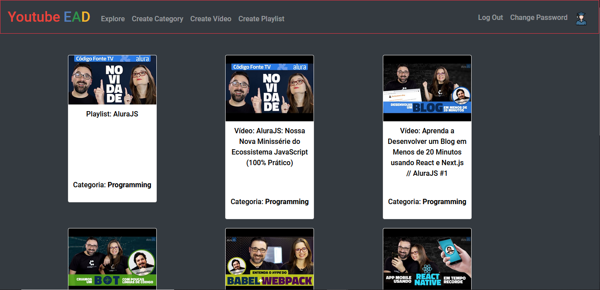

<h1 align="center">
    <a href="https://www.youtube.com/">🔗 Youtube</a> EAD (JS)</a>
</h1>
<h2 align="center">🚀 Study via Youtube 🚀</h2>



Content
=================
   * [About](#About)
   * [Technologies](#Technologies)
   * [Downloading](#Downloading)
   * [StartingTheApplication](#Starting)
  
<h3 align="center"> 
	🚧 Build in progress... 🚧
</h3>
 
<div id="About">    

## About
### This is @ davidlpc1's final project for Harvard's cs50 course.
### P.S:That repository isn't the final project in Flask(Python),but in Express(Javascript)
### The project proposes that you study through educational YouTube videos and help other students present on our platform, adding videos and playlists

</div>

<div id="Downloading">

## Downloading

<strong><a href="https://github.com/davidlpc1/youtube-ead-js/archive/main.zip">Download ZIP</a></strong>
<strong>OR</strong>

```
git clone https://github.com/davidlpc1/youtube-ead-js
```

</div>

<div id="Technologies">

## Technologies

<code></code>
<code></code>
<code></code>
<code></code>
<code></code>
<code></code>
</div>

<div id="Starting">

## Terminal 
```
    yarn 
    yarn dev
```
</div>

### Features

- [x] Register user
- [x] Login User
- [ ] Register video
- [ ] Register playlist
- [ ] Register Category
- [ ] View user
- [ ] View video
- [ ] View playlist
- [ ] Like a video
- [ ] Dislike a video
- [ ] Show how many likes a video has
- [ ] Show how many dislikes a video has
- [x] Update password of user 
- [x] Update name of user 
- [x] Update image of user 
- [ ] Update Level of user
- [ ] Update playlist
- [ ] All actions of user in index page

### Autor
---

<a href="https://github.com/davidlpc1">
 
 <br />
 <sub><b>Davi Lucas</b></sub></a> <a href="https://app.rocketseat.com.br/me/davi-lucas-marques-de-freitas-04149">🚀</a>


Made with ❤️ by Davi Lucas 👋🏽 Contact me!

[](https://twitter.com/ProgramadorDavi) [](https://www.linkedin.com/in/davi-lucas-93abb71b3/) 
[](mailto:davilucasdlcreator@gmail.com)